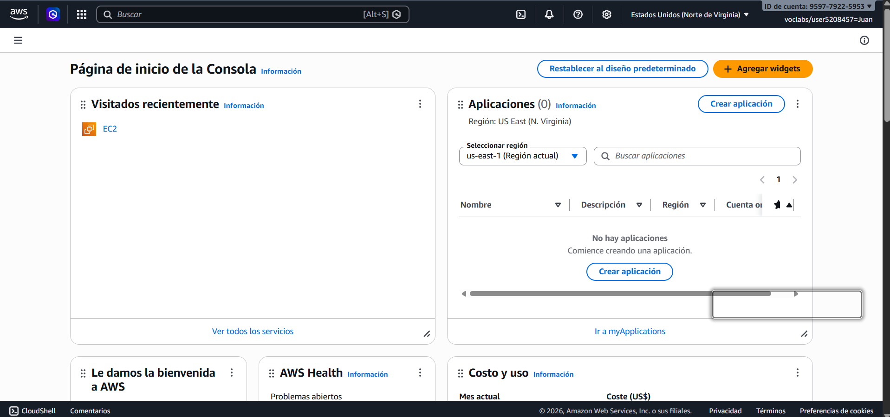
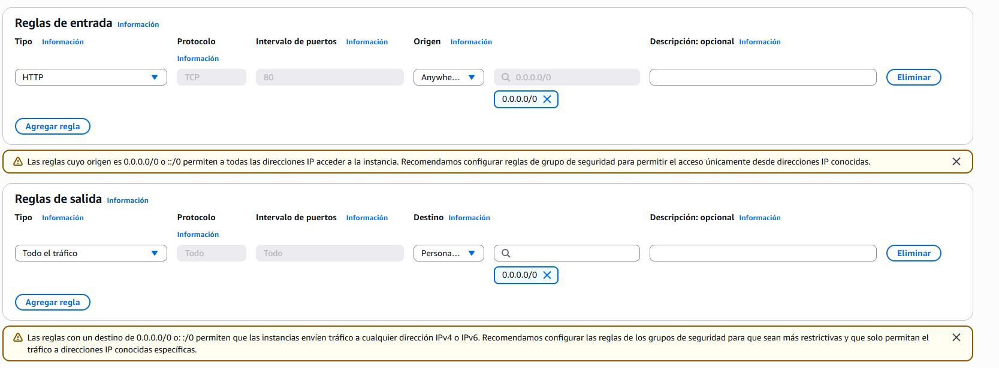
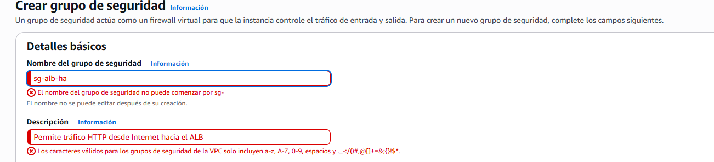
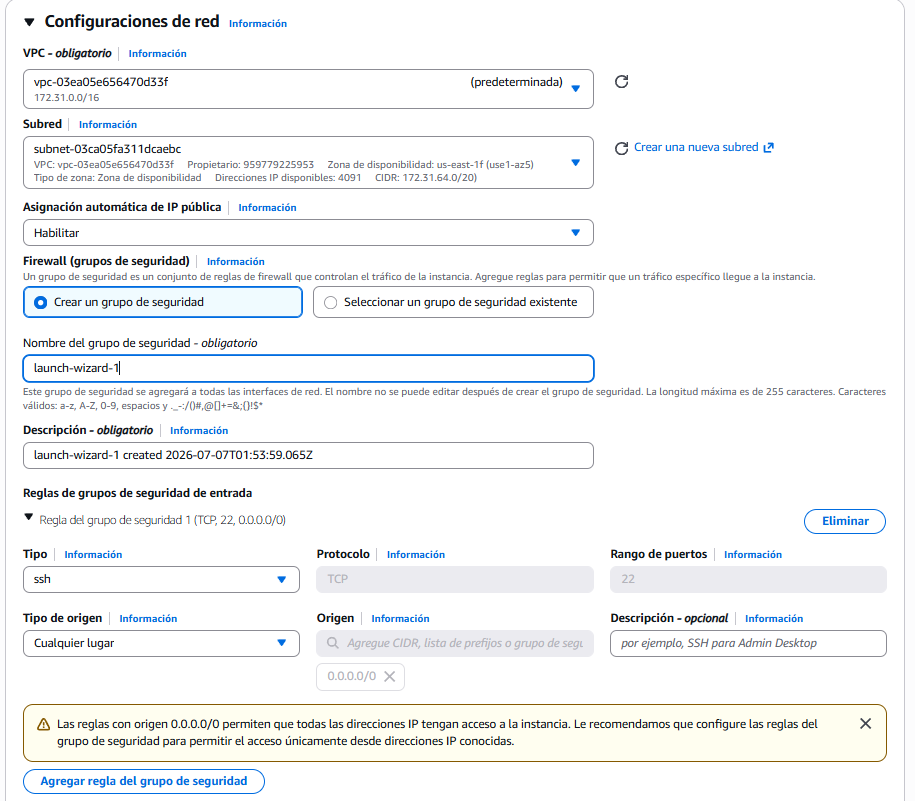
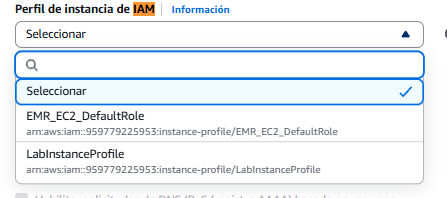
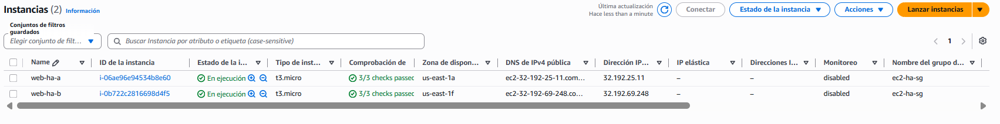
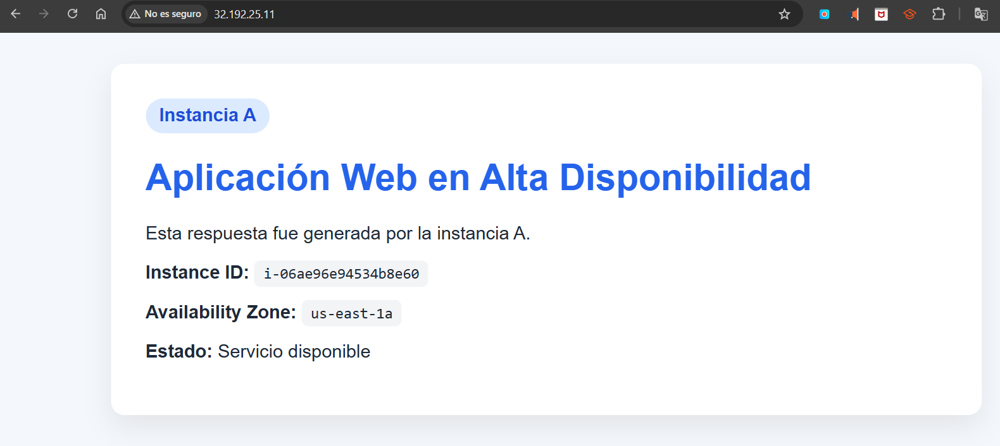
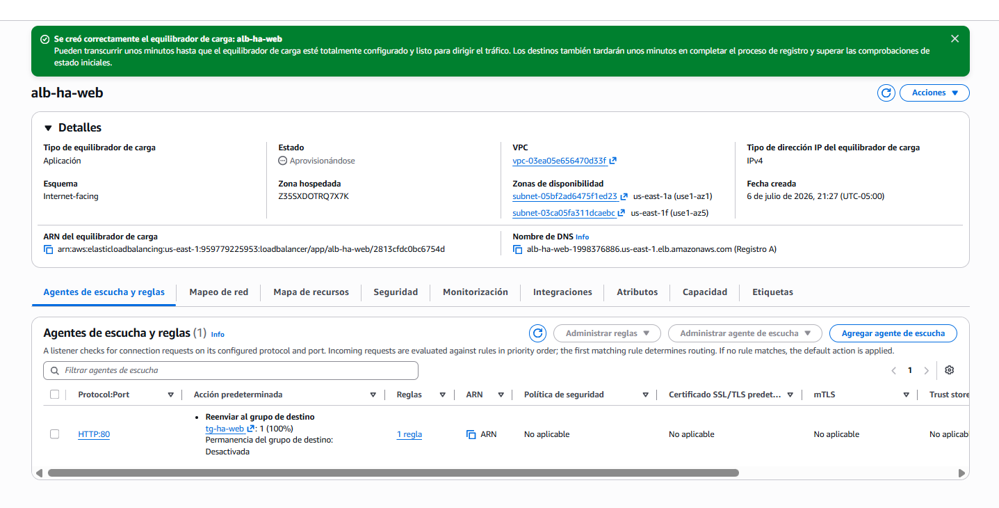
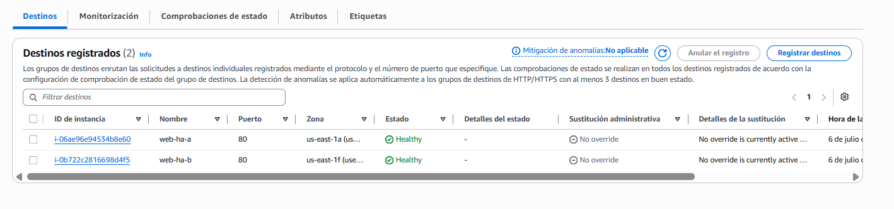
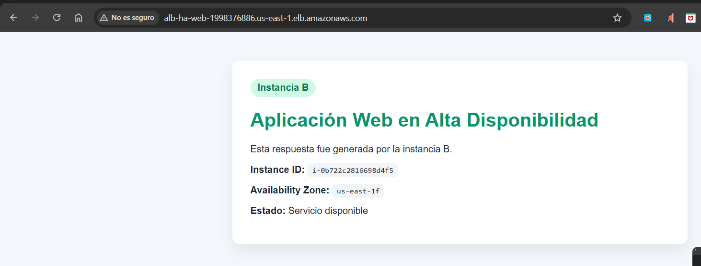

# High Availability with Application Load Balancer on AWS

Lab for the **Software Architectures** course — implementation of a basic
high-availability architecture on AWS Academy Learner Lab using two EC2
instances in different availability zones, a Target Group with health checks,
and an Application Load Balancer.

## Repository structure

```
/README.md          Theory, execution log, and answers to the activities
/scripts/           User Data scripts (provided by the guide) for each EC2 instance
/docs/images/        Lab screenshots (Final Challenge, section 8)
```

This lab is not organized into independent exercises: it is a single
continuous workflow (Security Groups → EC2 → Target Group → ALB → testing →
failure simulation → cleanup), so all the documentation lives in this single
README.

## 1. Core concepts

### 1.1 High availability

The ability of a system to keep operating even when one of its components
fails. A single-instance system has a single point of failure: if that
server goes down, the whole system becomes unavailable.

```
Without redundancy:       With redundancy:
User                      User
  ↓                         ↓
Single server             Load balancer
                            ↓         ↓
                        Server A   Server B
```

If Server A fails, the load balancer redirects traffic to Server B.

### 1.2 Availability vs. scalability

- **Availability**: does the system keep working if something fails?
- **Scalability**: can the system handle more load as demand increases?

These are independent quality attributes: an architecture can be scalable but
not highly available (everything in a single availability zone), or highly
available but not auto-scaling (without Auto Scaling). This lab focuses on
**high availability with load balancing**, not scalability.

### 1.3 Application Load Balancer (ALB)

Receives user requests (HTTP/HTTPS) and distributes them across several
backend servers. Monitors the state of those servers through *health checks*
and only sends them traffic while they are healthy.

### 1.4 Target Group

A set of destinations (EC2 instances, in this lab) that the ALB sends
traffic to, registered with a specific protocol and port.

```
Target Group: tg-ha-web
 ├── EC2 instance A (AZ 1)
 └── EC2 instance B (AZ 2)
```

### 1.5 Health Check

A periodic check (e.g. `GET /health`) that the ALB performs on each target to
determine whether it can receive traffic. If a target stops responding
correctly, it is marked *Unhealthy* and the load balancer stops sending it
traffic until it responds again.

## 2. Target architecture

```
User / Browser / curl
            ↓
Application Load Balancer (public DNS)
     ↓                    ↓
EC2 Web A (AZ 1)     EC2 Web B (AZ 2)
Apache HTTPD          Apache HTTPD
```

## 3. Execution log

> This section is filled in as the lab progresses.

### 3.1 Initial setup

- Assigned region: **us-east-1 (US East, N. Virginia)**

### 3.2 Security Groups

> **Note — deviation from the guide:** AWS does not allow Security Group
> names starting with the `sg-` prefix, because AWS reserves that prefix for
> auto-generated IDs (`sg-0123abcd...`). The guide names the groups
> `sg-alb-ha` and `sg-ec2-ha`, but the console rejects those names. The
> following names are used instead:
>
> | Name in the guide | Name used in this lab |
> |---|---|
> | `sg-alb-ha` | `alb-ha-sg` |
> | `sg-ec2-ha` | `ec2-ha-sg` |
>
> The rest of the configuration (inbound/outbound rules, descriptions) stays
> the same as specified in the guide.

VPC used (default VPC): `vpc-03ea05e656470d33f`

| Security Group | ID | Inbound rule | Outbound rule |
|---|---|---|---|
| `alb-ha-sg` | `sg-0808e0cd3ade56777` | HTTP (TCP 80) from `0.0.0.0/0` | All traffic → `0.0.0.0/0` (default) |
| `ec2-ha-sg` | `sg-0d0cb03db103abeae` | HTTP (TCP 80) from `alb-ha-sg` | All traffic → `0.0.0.0/0` (default) |

**Why `ec2-ha-sg` references `alb-ha-sg` as its source (instead of an IP):**
the ALB will be deployed across two availability zones, so it has more than
one IP address, and these can change. Referencing the ALB's Security Group
as the source means "accept traffic from any resource that has this Security
Group attached", without depending on specific IP addresses. This also
applies the principle of least privilege: the EC2 instances only accept
traffic that goes through the ALB, not direct traffic from any IP on the
Internet.

### 3.3 EC2 instances

| Instance | ID | Public IP | Availability Zone | Security Group |
|---|---|---|---|---|
| `web-ha-a` | `i-06ae96e94534b8e60` | `32.192.25.11` | us-east-1a | `ec2-ha-sg` |
| `web-ha-b` | `i-0b722c2816698d4f5` | `32.192.69.248` | us-east-1f | `ec2-ha-sg` |

Both instances are `t3.micro`, using the `ARSW` key pair (RSA, `.pem`), no IAM
instance profile, with public IP enabled, using the User Data provided by the
guide ([scripts/user-data-web-ha-a.sh](scripts/user-data-web-ha-a.sh) and
[scripts/user-data-web-ha-b.sh](scripts/user-data-web-ha-b.sh)).

**Verification (guide point 12):**

| URL | Result |
|---|---|
| `http://32.192.25.11` | "Instance A" card with correct Instance ID and AZ |
| `http://32.192.69.248` | "Instance B" card with correct Instance ID and AZ |
| `http://32.192.25.11/health` | `OK` |
| `http://32.192.69.248/health` | `OK` |

> **Note — inconsistency found in the guide:** point 12 asks to test each
> instance's public IP *before* creating the Target Group and the ALB (points
> 13 and 14). However, the `ec2-ha-sg` rule configured in point 9 only allows
> HTTP traffic whose source is the `alb-ha-sg` Security Group, which does not
> exist yet at this stage of the lab (the ALB has not been created). As a
> result, the direct browser test failed with `ERR_CONNECTION_TIMED_OUT` —
> which is actually the **correct** behavior of the Security Group, not a
> misconfiguration.
>
> **Applied fix:** a second inbound rule was temporarily added to
> `ec2-ha-sg` (HTTP, TCP 80, source `0.0.0.0/0`, described as "TEMPORARY")
> just to validate that Apache and `/health` responded correctly on each
> instance. That rule is removed immediately after verification, leaving
> `ec2-ha-sg` with only the `alb-ha-sg`-sourced rule before moving on to the
> Target Group.

### 3.4 Target Group

| Field | Value |
|---|---|
| Name | `tg-ha-web` |
| ARN | `arn:aws:elasticloadbalancing:us-east-1:959779225953:targetgroup/tg-ha-web/6d97a0b3f3114ee9` |
| Target type | Instance |
| Protocol : Port | HTTP : 80 |
| Protocol version | HTTP1 |
| VPC | `vpc-03ea05e656470d33f` |
| Health check | HTTP, path `/health`, traffic port, 15s interval, 5s timeout, 2/2 healthy/unhealthy threshold, success code 200 |
| Registered targets | `web-ha-a` (port 80), `web-ha-b` (port 80) |

When the Target Group is first created, both targets show up as **"Unused"**
— this is expected, since there is no Load Balancer associated yet to send
them traffic. This state changes to *Healthy* once the ALB is created
(section 3.5).

### 3.5 Application Load Balancer

| Field | Value |
|---|---|
| Name | `alb-ha-web` |
| ARN | `arn:aws:elasticloadbalancing:us-east-1:959779225953:loadbalancer/app/alb-ha-web/2813cfdc0bc6754d` |
| Scheme | Internet-facing |
| DNS | `alb-ha-web-1998376886.us-east-1.elb.amazonaws.com` |
| VPC | `vpc-03ea05e656470d33f` |
| Availability zones | us-east-1a (`subnet-05bf2ad6475f1ed23`), us-east-1f (`subnet-03ca05fa311dcaebc`) |
| Security Group | `alb-ha-sg` |
| Listener | HTTP : 80 → forward to `tg-ha-web` (100%) |

**Verification (guide points 15-16):**

- Both targets in `tg-ha-web` turned **Healthy** a few minutes after creating
  the ALB.
- Opening `http://alb-ha-web-1998376886.us-east-1.elb.amazonaws.com` and
  reloading several times, the ALB alternated responses between the blue
  card (Instance A) and the green card (Instance B), confirming load
  balancing across both availability zones.
- Note: right after creating the ALB, the first request returned
  `ERR_TIMED_OUT` because the balancer was still in "Provisioning" state;
  after waiting ~1 minute it responded normally.

## 4. Analysis activities

### Activity 1: load balancing analysis

**Which instance responded first?**
Instance B (`i-0b722c2816698d4f5`, us-east-1f), right after the ALB finished
provisioning (the first attempt immediately after creating the ALB returned
`ERR_TIMED_OUT` because it wasn't ready yet).

**Did the load balancer alternate between both instances?**
Yes. Reloading the ALB's DNS URL several times, the responses alternated
between the blue card (Instance A) and the green card (Instance B).

**What information confirms that more than one instance is active?**
The `Instance ID` and `Availability Zone` shown on each HTML card. If it were
a single instance, those values would always be the same; seeing them switch
between `i-06ae96e94534b8e60` (us-east-1a) and `i-0b722c2816698d4f5`
(us-east-1f) proves they are two physically distinct servers.

**What role does the Target Group play?**
It groups the destinations (the EC2 instances), runs health checks on each
one, and keeps the list of which ones are *Healthy* or *Unhealthy*. The ALB
consults that list to know who it can send traffic to — the Target Group
does not decide the distribution algorithm, but it does filter who is
eligible.

**What role do health checks play?**
They periodically verify (every 15s) that each instance responds `OK` on the
`/health` path. If an instance fails the check twice in a row (unhealthy
threshold), the Target Group marks it *Unhealthy* and the ALB stops sending
it traffic until it responds correctly twice in a row again (healthy
threshold).

**Why doesn't the user need to know the instances' public IPs?**
Because the ALB acts as an abstraction layer: the user only interacts with a
single, stable address (the ALB's DNS name). Behind that address there can be
any number of instances, and they can change (be added, removed, or fail)
without the user noticing or needing to update anything on their side.

### Activity 2: failure analysis

**Simulation performed:** the `web-ha-a` instance was stopped via
EC2 → Instances → Instance state → Stop instance.

**What happened when instance A was stopped?**
In the `tg-ha-web` Target Group, `web-ha-a` went from *Healthy* to
**"Unused"**, with the detail "Target is in the stopped state" (not
*Unhealthy*, since that state applies to running instances that fail the
health check; a stopped instance is classified differently, but the effect
is the same: it stops receiving traffic).

**Did the whole system become unavailable?**
No. Testing the ALB's DNS repeatedly, every response came from `web-ha-b`
(Instance B) — the service remained available with no perceptible
interruption for the user.

**What did the Load Balancer do when it detected the failure?**
It stopped sending traffic to `web-ha-a` and routed 100% of requests to
`web-ha-b`, the only target still in *Healthy* state.

**What difference would there be if only one instance existed?**
The whole system would have gone down until that single instance was
manually restarted — it would be a single point of failure, as described in
the core concepts section (3.1).

**Which quality attribute does this architecture improve?**
**Availability**: the system keeps responding even if a component fails,
thanks to redundancy (two instances in different zones) and to the ALB's
ability to dynamically redirect traffic based on the health state of each
target.

### Activity 3: recovery analysis

**Recovery performed:** `web-ha-a` was started again via
EC2 → Instances → Instance state → Start instance.

**What happened when instance A became healthy again?**
After passing the status checks, the Target Group marked `web-ha-a` as
*Healthy* again, alongside `web-ha-b` (2 healthy targets).

**Did the load balancer start sending it traffic again?**
Yes. Testing the ALB's DNS repeatedly, responses from both instances
appeared again.

**Additional observation:** traffic distribution does not strictly alternate
A-B-A-B on every browser reload — sometimes several consecutive reloads
return the same instance. This happens because the ALB distributes traffic
**per HTTP connection**, not per individual request/click: the browser
reuses the same connection (keep-alive) for several consecutive reloads, so
all those responses come from the same target until a new connection is
opened. This matches what the guide anticipates in point 25, Case 3 ("The
load balancer maintains temporary affinity").

**Why is it important for recovery to be automatic from the user's
perspective?**
Because the user never had to do anything and was never aware of the
failure or the recovery: the system self-managed at the network level
(Target Group + ALB) with no manual intervention on the client side.

**What limitations does this architecture have if the instance is not
restarted manually?**
If nobody manually restarts `web-ha-a` after a real failure (not an
intentional stop), that instance would remain out of service indefinitely.
The ALB and Target Group only stop sending traffic to a failed target, but
they have no ability to replace it or restart it on their own — that kind of
automatic recovery would require Auto Scaling (see guide section 22), which
is out of scope for this lab.

### Activity 4: production improvement proposal

**How would I add automatic recovery?**
With a Launch Template + Auto Scaling Group (desired 2, min 2, max 3)
pointing at the `tg-ha-web` Target Group, using the ELB health checks so the
ASG automatically replaces any instance reported as unhealthy, instead of
relying on a manual restart.

**How would I protect the instances so they aren't public?**
By placing them in private subnets, with no public IP, behind the ALB (which
remains the only Internet-facing component). For them to keep downloading OS
packages without being directly exposed, a NAT Gateway would be needed in a
public subnet.

**How would I add HTTPS?**
By issuing a free TLS certificate with AWS Certificate Manager (ACM) and
adding an HTTPS listener (port 443) to the ALB referencing that certificate,
also redirecting the HTTP:80 listener to HTTPS.

**How would I log and monitor metrics?**
By enabling ALB Access Logs to an S3 bucket (detail of every HTTP request)
and using Amazon CloudWatch for aggregate metrics (latency, request count,
healthy/unhealthy host count).

**How would I handle zero-downtime deployments?**
With a rolling deployment: replace the Target Group's instances gradually
(or in small batches) — launch the instance with the new version, wait for
the health check to mark it Healthy, and only then retire the next old
instance. The ALB always keeps at least one healthy target receiving traffic
throughout the process.

**What components would I add for a highly available database?**
Amazon RDS in Multi-AZ mode: it automatically replicates data to a standby
instance in another availability zone and fails over to it if the primary
fails, applying the same zone-redundancy principle used here for the web
layer.

## 5. Glossary of services and concepts mentioned

> Quick reference for every AWS service/concept mentioned in this document
> (especially in Activity 4), so you don't have to rely on memory.

**Application Load Balancer (ALB)**
Layer-7 (HTTP/HTTPS) load balancer. Receives user requests at a single
public DNS name and distributes them across the healthy targets of one or
more Target Groups. This is the `alb-ha-web` component in this lab.

**Target Group**
A set of destinations (EC2 instances, IPs, Lambda functions, etc.) that an
ALB or NLB can send traffic to. It keeps track of each destination's health
state through health checks. This is the `tg-ha-web` component.

**Health Check**
A periodic check (e.g. `GET /health`) that the Target Group performs on each
destination to decide whether it is fit to receive traffic.

**Security Group**
A virtual firewall at the instance/network-interface level. Filters inbound
and outbound traffic through rules whose source/destination can be an IP, a
CIDR range, or another Security Group.

**Launch Template**
A template that defines how an EC2 instance should be launched (AMI,
instance type, Security Groups, User Data, etc.), so an Auto Scaling Group
can automatically create identical instances.

**Auto Scaling Group (ASG)**
A service that automatically maintains a desired number of EC2 instances
(using a Launch Template), replacing ones that fail and being able to scale
up/down based on demand or configured policies. It integrates with the
ALB's health checks to know which instances to replace.

**NAT Gateway**
A resource that lets instances in **private** subnets (with no public IP)
reach the Internet (e.g. to download packages), without allowing inbound
traffic from the Internet to reach them directly.

**AWS Certificate Manager (ACM)**
A service that automatically issues and renews free TLS/SSL certificates,
used to enable HTTPS on an ALB without having to manage certificates
manually.

**Amazon CloudWatch**
AWS's metrics and monitoring service: collects metrics such as latency,
request count, or healthy/unhealthy target count, and lets you create alarms
on them.

**Access Logs (from the ALB, to S3)**
A detailed record of every HTTP request the ALB processes (source IP,
target that served it, response code, latency, etc.), stored as files in an
Amazon S3 bucket for later analysis.

**Rolling deployment**
A deployment strategy that replaces instances one at a time (or in small
batches): the new version is launched, the health check is awaited to mark
it *Healthy*, and only then is the equivalent old instance retired. It
avoids service downtime during an update.

**Amazon RDS Multi-AZ**
An Amazon RDS (managed relational database) mode that keeps a synchronized
*standby* replica in another availability zone and automatically fails over
to it if the primary instance fails — the same zone-redundancy principle
applied here to the data layer.

## 6. Architecture validation table

| Element | Role in the architecture |
|---|---|
| EC2 instance A (`web-ha-a`) | Redundant node running Apache HTTPD, serving web traffic and health checks; acts as backup/redundancy within the Target Group alongside instance B. |
| EC2 instance B (`web-ha-b`) | Same as instance A: a redundant node in a different availability zone, ready to take over traffic if A fails. |
| Application Load Balancer (`alb-ha-web`) | Receives user requests at a single entry point (public DNS) and distributes them across healthy instances, without exposing each instance's individual IP. |
| Target Group (`tg-ha-web`) | Groups the EC2 instances as targets, runs health checks on each one, and tells the ALB which ones are *Healthy* and can receive traffic. |
| Health Check (`/health`) | Periodically verifies (every 15s) that each instance responds `OK`; after 2 consecutive failures it is marked *Unhealthy* and stops receiving traffic until it recovers. |
| ALB Security Group (`alb-ha-sg`) | Controls public access to the balancer: allows HTTP traffic (port 80) from any IP on the Internet (`0.0.0.0/0`), being the only external entry point of the system. |
| EC2 Security Group (`ec2-ha-sg`) | Restricts access to the instances so they only accept HTTP traffic coming from the ALB's Security Group (`alb-ha-sg`), preventing anyone from bypassing the balancer and hitting the instances directly. |
| Availability zones (us-east-1a, us-east-1f) | Physically distribute the instances and the ALB itself across independent data centers, so that a complete zone outage does not make the system unavailable. |

## 7. How to reproduce this lab

1. Create the `sg-alb-ha` and `sg-ec2-ha` Security Groups (see section 3.2).
2. Launch two EC2 instances (`web-ha-a`, `web-ha-b`) in different
   availability zones, using `scripts/user-data-web-ha-a.sh` and
   `scripts/user-data-web-ha-b.sh` as User Data.
3. Create the `tg-ha-web` Target Group with a health check on `/health` and
   register both instances.
4. Create the `alb-ha-web` Application Load Balancer pointing at the Target
   Group.
5. Verify load balancing, simulate an instance failure, and validate
   recovery.
6. Delete all resources when finished (see section 9).

## 8. Evidence (Final Challenge)

Screenshots taken during the lab, in the order they occurred. They cover the
points requested in the guide's "Final Challenge" (section 27). The original
files are in [docs/images/](docs/images/).

### Initial setup


*AWS Academy course home page.*


*Learner Lab started (green dot, timer running).*


*AWS console open, us-east-1 region confirmed.*

### Security Groups


*Inbound/outbound rules configured for `alb-ha-sg`.*


*AWS error when trying to name the group `sg-alb-ha` (deviation documented in
section 3.2).*


*The three existing Security Groups: `default`, `alb-ha-sg`, `ec2-ha-sg`.*

### EC2 instances


*Creation of the `ARSW` key pair.*


*Subnet/AZ selection for `web-ha-a`.*


*Network configuration for `web-ha-b`, correcting the Security Group.*


*IAM instance profile left as "None".*

**Required evidence — two EC2 instances running (Final Challenge point 2):**




*Direct IP access blocked before creating the ALB (inconsistency documented
in section 3.3).*


*Direct response from instance A.*


*Direct response from instance B.*


*Instance A's `/health` check → `OK`.*


*Instance B's `/health` check → `OK`.*

### Target Group and Application Load Balancer

**Required evidence — Target Group created (Final Challenge point 3):**


**Required evidence — Application Load Balancer created (Final Challenge point 4):**



**Required evidence — Target Group with both targets Healthy (Final Challenge point 3):**



### Load balancing

**Required evidence — response from instance B via the ALB (Final Challenge point 6):**



**Required evidence — response from instance A via the ALB (Final Challenge point 5):**


### Failure simulation and recovery

**Required evidence — simulated failure (Final Challenge point 7):**


*Recovery: both instances back to Healthy after restarting `web-ha-a`.*

## 9. Resource cleanup

Resources were deleted in this order to avoid dependency errors (a Target
Group can't be deleted while an ALB still references it, and a Security
Group can't be deleted while another one still references it as a source):

1. **Application Load Balancer** `alb-ha-web` — deleted.
2. **Target Group** `tg-ha-web` — deleted.
3. **EC2 instances** `web-ha-a` and `web-ha-b` — terminated.
4. **Security Groups** `ec2-ha-sg` (deleted first, since it referenced
   `alb-ha-sg`) and `alb-ha-sg` — both deleted.

**Status: complete.** No billable resources remain from this lab.

> **Note — session interruption during cleanup:** midway through deleting the
> Security Groups, the AWS Academy Learner Lab session expired (the default
> 4-hour session limit), which caused AWS to attach a temporary explicit-deny
> policy (`voc-cancel-cred`) blocking all EC2 API calls, including read-only
> `Describe*` operations. This was not caused by anything done in this lab —
> restarting the Learner Lab session (**Start Lab** again) restored access,
> and the remaining Security Groups were deleted normally afterward.
