# Alta Disponibilidad con Application Load Balancer en AWS

Laboratorio de la asignatura **Arquitecturas de Software** — implementación de una
arquitectura básica de alta disponibilidad en AWS Academy Learner Lab usando dos
instancias EC2 en zonas de disponibilidad distintas, un Target Group con health
checks y un Application Load Balancer.

## Estructura del repositorio

```
/README.md            Teoría, bitácora de ejecución, respuestas a las actividades
/scripts/              Scripts de User Data (provistos por la guía) para cada instancia EC2
/evidencias/           Capturas de pantalla numeradas del laboratorio (Reto final, sección 9)
```

Este laboratorio no se organiza en ejercicios independientes: es un solo flujo de
trabajo continuo (Security Groups → EC2 → Target Group → ALB → pruebas → simulación
de falla → limpieza), por lo que toda la documentación vive en este único README.

## 1. Conceptos base

### 1.1 Alta disponibilidad

Es la capacidad de un sistema para mantenerse operativo aunque alguno de sus
componentes falle. Un sistema de instancia única tiene un punto único de falla
(*single point of failure*): si el servidor cae, el sistema completo queda
indisponible.

```
Sin redundancia:          Con redundancia:
Usuario                   Usuario
  ↓                         ↓
Servidor único            Balanceador de carga
                            ↓         ↓
                        Servidor A  Servidor B
```

Si el Servidor A falla, el balanceador redirige el tráfico al Servidor B.

### 1.2 Disponibilidad vs. escalabilidad

- **Disponibilidad**: ¿el sistema sigue funcionando si algo falla?
- **Escalabilidad**: ¿el sistema puede atender más carga si aumenta la demanda?

Son atributos de calidad independientes: una arquitectura puede escalar pero no ser
altamente disponible (todo en una sola zona de disponibilidad), o ser altamente
disponible pero no escalar automáticamente (sin Auto Scaling). Este laboratorio se
enfoca en **alta disponibilidad con balanceo de carga**, no en escalabilidad.

### 1.3 Application Load Balancer (ALB)

Recibe las solicitudes de los usuarios (HTTP/HTTPS) y las distribuye entre varios
servidores backend. Monitorea el estado de esos servidores mediante *health checks*
y solo les envía tráfico si están saludables.

### 1.4 Target Group

Conjunto de destinos (en este laboratorio, instancias EC2) a los que el ALB envía
tráfico, registrados con un protocolo y puerto específicos.

```
Target Group: tg-ha-web
 ├── EC2 instancia A (AZ 1)
 └── EC2 instancia B (AZ 2)
```

### 1.5 Health Check

Verificación periódica (ej. `GET /health`) que el ALB hace a cada target para saber
si puede recibir tráfico. Si el target no responde correctamente, se marca
*Unhealthy* y el balanceador deja de enviarle tráfico hasta que vuelva a responder.

## 2. Arquitectura objetivo

```
Usuario / Navegador / curl
            ↓
Application Load Balancer (DNS público)
     ↓                    ↓
EC2 Web A (AZ 1)     EC2 Web B (AZ 2)
Apache HTTPD          Apache HTTPD
```

## 3. Bitácora de ejecución

> Esta sección se completa a medida que se avanza en el laboratorio.

### 3.1 Preparación inicial

- Región asignada: **us-east-1 (US East, N. Virginia)**

### 3.2 Security Groups

> **Nota — desviación respecto a la guía:** AWS no permite nombres de Security
> Group que empiecen con el prefijo `sg-`, porque ese prefijo lo reserva AWS para
> los IDs autogenerados (`sg-0123abcd...`). La guía nombra los grupos `sg-alb-ha`
> y `sg-ec2-ha`, pero la consola rechaza esos nombres. Se usan en su lugar:
>
> | Nombre en la guía | Nombre usado en este laboratorio |
> |---|---|
> | `sg-alb-ha` | `alb-ha-sg` |
> | `sg-ec2-ha` | `ec2-ha-sg` |
>
> El resto de la configuración (reglas de entrada/salida, descripciones) se
> mantiene igual a lo indicado en la guía.

VPC utilizada (VPC predeterminada): `vpc-03ea05e656470d33f`

| Security Group | ID | Regla de entrada | Regla de salida |
|---|---|---|---|
| `alb-ha-sg` | `sg-0808e0cd3ade56777` | HTTP (TCP 80) desde `0.0.0.0/0` | All traffic → `0.0.0.0/0` (default) |
| `ec2-ha-sg` | `sg-0d0cb03db103abeae` | HTTP (TCP 80) desde `alb-ha-sg` | All traffic → `0.0.0.0/0` (default) |

**Por qué `ec2-ha-sg` referencia a `alb-ha-sg` como origen (en vez de una IP):**
el ALB estará desplegado en dos zonas de disponibilidad, por lo que tiene más de
una IP y estas pueden cambiar. Referenciar el Security Group del ALB como origen
significa "acepta tráfico de cualquier recurso que tenga este Security Group
asociado", sin depender de direcciones IP concretas. Esto también aplica el
principio de menor privilegio: las instancias EC2 solo aceptan tráfico que pase
por el ALB, no tráfico directo desde cualquier IP de Internet.

### 3.3 Instancias EC2

| Instancia | ID | IP pública | Zona de disponibilidad | Security Group |
|---|---|---|---|---|
| `web-ha-a` | `i-06ae96e94534b8e60` | `32.192.25.11` | us-east-1a | `ec2-ha-sg` |
| `web-ha-b` | `i-0b722c2816698d4f5` | `32.192.69.248` | us-east-1f | `ec2-ha-sg` |

Ambas instancias tipo `t3.micro`, par de claves `ARSW` (RSA, `.pem`), sin perfil de
instancia de IAM, con IP pública habilitada, usando el User Data provisto por la
guía ([scripts/user-data-web-ha-a.sh](scripts/user-data-web-ha-a.sh) y
[scripts/user-data-web-ha-b.sh](scripts/user-data-web-ha-b.sh)).

**Verificación (punto 12 de la guía):**

| URL | Resultado |
|---|---|
| `http://32.192.25.11` | Tarjeta "Instancia A" con Instance ID y AZ correctos |
| `http://32.192.69.248` | Tarjeta "Instancia B" con Instance ID y AZ correctos |
| `http://32.192.25.11/health` | `OK` |
| `http://32.192.69.248/health` | `OK` |

> **Nota — inconsistencia detectada en la guía:** el punto 12 pide probar la IP
> pública de cada instancia *antes* de crear el Target Group y el ALB (puntos 13
> y 14). Sin embargo, la regla de `ec2-ha-sg` configurada en el punto 9 solo
> permite tráfico HTTP con origen el Security Group `alb-ha-sg`, que en este
> punto del laboratorio todavía no existe (el ALB no se ha creado). Como
> resultado, la prueba directa por navegador fallaba con
> `ERR_CONNECTION_TIMED_OUT` — lo cual en realidad es el comportamiento
> **correcto** del Security Group, no un error de configuración.
>
> **Solución aplicada:** se agregó temporalmente una segunda regla de entrada en
> `ec2-ha-sg` (HTTP, TCP 80, origen `0.0.0.0/0`, descrita como "TEMPORAL") solo
> para validar que Apache y `/health` respondían correctamente en cada
> instancia. Esa regla se elimina inmediatamente después de la verificación,
> dejando `ec2-ha-sg` únicamente con la regla de origen `alb-ha-sg` antes de
> continuar con el Target Group.

### 3.4 Target Group

| Campo | Valor |
|---|---|
| Nombre | `tg-ha-web` |
| ARN | `arn:aws:elasticloadbalancing:us-east-1:959779225953:targetgroup/tg-ha-web/6d97a0b3f3114ee9` |
| Tipo de destino | Instancia |
| Protocolo : Puerto | HTTP : 80 |
| Versión del protocolo | HTTP1 |
| VPC | `vpc-03ea05e656470d33f` |
| Health check | HTTP, ruta `/health`, puerto de tráfico, intervalo 15s, timeout 5s, umbral saludable/no saludable 2/2, código de éxito 200 |
| Destinos registrados | `web-ha-a` (puerto 80), `web-ha-b` (puerto 80) |

Al momento de crear el Target Group, ambos destinos aparecen en estado **"Sin
utilizar" (Unused)** — es el comportamiento esperado, porque todavía no hay
ningún Load Balancer asociado que les envíe tráfico. Este estado cambia a
*Healthy* una vez se crea el ALB (sección 3.5).

### 3.5 Application Load Balancer

| Campo | Valor |
|---|---|
| Nombre | `alb-ha-web` |
| ARN | `arn:aws:elasticloadbalancing:us-east-1:959779225953:loadbalancer/app/alb-ha-web/2813cfdc0bc6754d` |
| Esquema | Internet-facing (expuesto a Internet) |
| DNS | `alb-ha-web-1998376886.us-east-1.elb.amazonaws.com` |
| VPC | `vpc-03ea05e656470d33f` |
| Zonas de disponibilidad | us-east-1a (`subnet-05bf2ad6475f1ed23`), us-east-1f (`subnet-03ca05fa311dcaebc`) |
| Security Group | `alb-ha-sg` |
| Listener | HTTP : 80 → reenviar a `tg-ha-web` (100%) |

**Verificación (punto 15-16 de la guía):**

- Ambos destinos en `tg-ha-web` pasaron a estado **Healthy** unos minutos después
  de crear el ALB.
- Al abrir `http://alb-ha-web-1998376886.us-east-1.elb.amazonaws.com` y
  recargar varias veces, el ALB alternó las respuestas entre la tarjeta azul
  (Instancia A) y la tarjeta verde (Instancia B), confirmando el balanceo de
  carga entre ambas zonas de disponibilidad.
- Nota: justo después de crear el ALB, la primera petición dio
  `ERR_TIMED_OUT` porque el balanceador aún estaba en estado
  "Aprovisionándose"; tras esperar ~1 minuto respondió con normalidad.

## 4. Actividades de análisis

### Actividad 1: análisis del balanceo

**¿Qué instancia respondió primero?**
La instancia B (`i-0b722c2816698d4f5`, us-east-1f), justo después de que el ALB
terminara de aprovisionarse (el primer intento inmediatamente después de crear
el ALB dio `ERR_TIMED_OUT` porque aún no estaba listo).

**¿El balanceador alternó entre ambas instancias?**
Sí. Al recargar varias veces la URL del DNS del ALB, las respuestas alternaron
entre la tarjeta azul (Instancia A) y la tarjeta verde (Instancia B).

**¿Qué información permite confirmar que hay más de una instancia activa?**
El `Instance ID` y la `Availability Zone` que muestra cada tarjeta HTML. Si
fuera una sola instancia, esos valores serían siempre los mismos; al cambiar
entre `i-06ae96e94534b8e60` (us-east-1a) e `i-0b722c2816698d4f5` (us-east-1f),
queda demostrado que son dos servidores físicamente distintos.

**¿Qué papel cumple el Target Group?**
Agrupa los destinos (las instancias EC2), ejecuta los health checks sobre cada
una y mantiene la lista de cuáles están *Healthy* o *Unhealthy*. El ALB
consulta esa lista para saber a quién le puede enviar tráfico — el Target
Group no decide el algoritmo de reparto, pero sí filtra quién es elegible.

**¿Qué papel cumplen los health checks?**
Verifican periódicamente (cada 15s) que cada instancia responda `OK` en la
ruta `/health`. Si una instancia falla el chequeo 2 veces seguidas
(Unhealthy threshold), el Target Group la marca como *Unhealthy* y el ALB dej
de enviarle tráfico hasta que vuelva a responder correctamente 2 veces
seguidas (Healthy threshold).

**¿Por qué el usuario no necesita conocer las IP públicas de las instancias?**
Porque el ALB actúa como una capa de abstracción: el usuario solo interactúa
con una única dirección estable (el DNS del ALB). Detrás de esa dirección
puede haber cualquier número de instancias, y estas pueden cambiar (agregarse,
eliminarse, fallar) sin que el usuario lo note ni tenga que actualizar nada de
su lado.

### Actividad 2: análisis de falla

**Simulación realizada:** se detuvo la instancia `web-ha-a` desde
EC2 → Instancias → Estado de la instancia → Detener instancia.

**¿Qué ocurrió cuando se detuvo la instancia A?**
En el Target Group `tg-ha-web`, `web-ha-a` pasó de *Healthy* a **"Unused"**,
con el detalle "Target is in the stopped state" (no a *Unhealthy*, ya que ese
estado aplica a instancias corriendo que fallan el health check; una instancia
apagada se clasifica distinto, pero el efecto es el mismo: deja de recibir
tráfico).

**¿El sistema completo dejó de estar disponible?**
No. Al probar el DNS del ALB repetidamente, todas las respuestas llegaron
desde `web-ha-b` (Instancia B) — el servicio siguió disponible sin
interrupción perceptible para el usuario.

**¿Qué hizo el Load Balancer cuando detectó la falla?**
Dejó de enviar tráfico a `web-ha-a` y enrutó el 100% de las solicitudes hacia
`web-ha-b`, el único destino que seguía en estado *Healthy*.

**¿Qué diferencia habría si solo existiera una instancia?**
Todo el sistema habría quedado caído hasta reiniciar manualmente esa única
instancia — sería un punto único de falla (single point of failure), como se
describió en la sección de conceptos base (3.1).

**¿Qué atributo de calidad mejora esta arquitectura?**
La **disponibilidad**: el sistema sigue respondiendo aunque un componente
falle, gracias a la redundancia (dos instancias en zonas distintas) y a que el
ALB puede redirigir el tráfico dinámicamente según el estado de salud de cada
destino.

### Actividad 3: análisis de recuperación

**Recuperación realizada:** se inició nuevamente `web-ha-a` desde
EC2 → Instancias → Estado de la instancia → Iniciar instancia.

**¿Qué ocurrió cuando la instancia A volvió a estar saludable?**
Tras pasar los status checks, el Target Group volvió a marcar `web-ha-a` como
*Healthy*, junto a `web-ha-b` (2 destinos en buen estado).

**¿El balanceador volvió a enviarle tráfico?**
Sí. Al probar el DNS del ALB repetidamente volvieron a aparecer respuestas de
ambas instancias.

**Observación adicional:** el reparto de tráfico no alterna estrictamente
A-B-A-B en cada recarga del navegador — a veces varias recargas seguidas
devuelven la misma instancia. Esto se debe a que el ALB reparte tráfico **por
conexión HTTP**, no por cada solicitud/clic individual: el navegador reutiliza
una misma conexión (keep-alive) para varias recargas seguidas, por lo que
todas esas respuestas provienen del mismo destino hasta que se abre una
conexión nueva. Esto coincide con lo que la guía anticipa en el punto 25,
Caso 3 ("El balanceador mantiene afinidad temporal").

**¿Por qué es importante que la recuperación sea automática desde el punto de
vista del usuario?**
Porque el usuario nunca tuvo que hacer nada ni fue consciente de la falla ni
de la recuperación: el sistema se autogestionó a nivel de red (Target Group +
ALB) sin intervención manual del lado del cliente.

**¿Qué limitaciones tiene esta arquitectura si la instancia no se reinicia
manualmente?**
Si nadie reinicia manualmente `web-ha-a` tras una falla real (no una parada
intencional), esa instancia permanecería fuera de servicio indefinidamente. El
ALB y el Target Group solo dejan de enviarle tráfico a un destino caído, pero
no tienen capacidad de reemplazarlo ni de reiniciarlo por sí mismos — esa
recuperación automática requeriría Auto Scaling (ver sección 22 de la guía),
que queda fuera del alcance de este laboratorio.

### Actividad 4: propuesta de mejora hacia producción

**¿Cómo agregaría recuperación automática?**
Con un Launch Template + Auto Scaling Group (desired 2, min 2, max 3) apuntando
al Target Group `tg-ha-web`, usando los health checks del ELB para que el ASG
reemplace automáticamente cualquier instancia que se reporte como no
saludable, en vez de depender de un reinicio manual.

**¿Cómo protegería las instancias para que no sean públicas?**
Colocándolas en subredes privadas, sin IP pública, detrás del ALB (que sigue
siendo el único componente Internet-facing). Para que puedan seguir
descargando paquetes del sistema operativo sin exponerse directamente, se
necesitaría un NAT Gateway en una subred pública.

**¿Cómo agregaría HTTPS?**
Emitiendo un certificado TLS gratuito con AWS Certificate Manager (ACM) y
agregando un listener HTTPS (puerto 443) al ALB que referencie ese
certificado, redirigiendo además el listener HTTP:80 hacia HTTPS.

**¿Cómo registraría logs y métricas?**
Habilitando Access Logs del ALB hacia un bucket de S3 (detalle de cada
petición HTTP) y usando Amazon CloudWatch para métricas agregadas (latencia,
conteo de requests, healthy/unhealthy host count).

**¿Cómo manejaría despliegues sin caída?**
Con un rolling deployment: reemplazar las instancias del Target Group de a
poco (o en pequeños lotes) — lanzar la instancia con la versión nueva, esperar
a que el health check la marque Healthy, y solo entonces retirar la siguiente
instancia vieja. El ALB siempre mantiene al menos un destino sano recibiendo
tráfico durante todo el proceso.

**¿Qué componentes agregaría para una base de datos altamente disponible?**
Amazon RDS en modo Multi-AZ: replica automáticamente los datos a una instancia
standby en otra zona de disponibilidad y conmuta (failover) hacia ella si la
primaria falla, aplicando el mismo principio de redundancia por zonas que se
usó aquí para la capa web.

## 5. Glosario de servicios y conceptos mencionados

> Referencia rápida de cada servicio/concepto de AWS que aparece en este
> documento (especialmente en la Actividad 4), para no tener que recordarlos
> de memoria.

**Application Load Balancer (ALB)**
Balanceador de carga de capa 7 (HTTP/HTTPS). Recibe las peticiones de los
usuarios en un único DNS público y las distribuye entre los targets sanos de
uno o más Target Groups. Es el componente `alb-ha-web` de este laboratorio.

**Target Group**
Conjunto de destinos (instancias EC2, IPs, funciones Lambda, etc.) a los que
un ALB o NLB puede enviar tráfico. Mantiene el estado de salud de cada
destino mediante health checks. Es el componente `tg-ha-web`.

**Health Check**
Verificación periódica (por ejemplo `GET /health`) que hace el Target Group a
cada destino para decidir si está en condiciones de recibir tráfico.

**Security Group**
Firewall virtual a nivel de instancia/interfaz de red. Filtra tráfico de
entrada y salida mediante reglas que pueden tener como origen/destino una IP,
un rango CIDR, u otro Security Group.

**Launch Template**
Plantilla que define cómo debe lanzarse una instancia EC2 (AMI, tipo de
instancia, Security Groups, User Data, etc.), para que un Auto Scaling Group
pueda crear instancias idénticas automáticamente.

**Auto Scaling Group (ASG)**
Servicio que mantiene automáticamente un número deseado de instancias EC2
(usando un Launch Template), reemplazando las que fallen y pudiendo escalar
hacia arriba/abajo según demanda o políticas configuradas. Se integra con los
health checks del ALB para saber qué instancias reemplazar.

**NAT Gateway**
Recurso que permite a instancias en subredes **privadas** (sin IP pública)
salir a Internet (por ejemplo, para descargar paquetes), sin permitir que
tráfico entrante desde Internet llegue directamente a ellas.

**AWS Certificate Manager (ACM)**
Servicio que emite y renueva automáticamente certificados TLS/SSL gratuitos,
usados para habilitar HTTPS en un ALB sin tener que gestionar certificados
manualmente.

**Amazon CloudWatch**
Servicio de métricas y monitoreo de AWS: recolecta métricas como latencia,
número de peticiones, o cantidad de targets healthy/unhealthy, y permite
crear alarmas sobre ellas.

**Access Logs (del ALB, hacia S3)**
Registro detallado de cada petición HTTP que procesa el ALB (IP de origen,
target que la atendió, código de respuesta, latencia, etc.), almacenado como
archivos en un bucket de Amazon S3 para su posterior análisis.

**Rolling deployment**
Estrategia de despliegue que reemplaza las instancias de una en una (o en
pequeños lotes): se lanza la nueva versión, se espera a que el health check la
marque *Healthy*, y solo entonces se retira la instancia vieja equivalente.
Evita caídas de servicio durante una actualización.

**Amazon RDS Multi-AZ**
Modo de Amazon RDS (bases de datos relacionales administradas) que mantiene
una réplica *standby* sincronizada en otra zona de disponibilidad y conmuta
automáticamente (failover) hacia ella si la instancia primaria falla — el
mismo principio de redundancia por zonas aplicado a la capa de datos.

## 6. Tabla de validación arquitectónica

| Elemento | Función en la arquitectura |
|---|---|
| EC2 instancia A (`web-ha-a`) | Nodo redundante que ejecuta Apache HTTPD y responde tráfico web y health checks; sirve de respaldo/redundancia dentro del Target Group junto a la instancia B. |
| EC2 instancia B (`web-ha-b`) | Igual que la instancia A: nodo redundante en una zona de disponibilidad distinta, listo para asumir el tráfico si A falla. |
| Application Load Balancer (`alb-ha-web`) | Recibe las peticiones de los usuarios en un único punto de entrada (DNS público) y las reparte entre las instancias que estén sanas, sin exponer las IPs individuales de cada una. |
| Target Group (`tg-ha-web`) | Agrupa las instancias EC2 como destinos, ejecuta los health checks sobre cada una y le informa al ALB cuáles están *Healthy* y pueden recibir tráfico. |
| Health Check (`/health`) | Verifica periódicamente (cada 15s) que cada instancia responda `OK`; tras 2 fallos seguidos la marca *Unhealthy* y dejar de recibir tráfico hasta que se recupere. |
| Security Group del ALB (`alb-ha-sg`) | Controla el acceso público al balanceador: permite tráfico HTTP (puerto 80) desde cualquier IP de Internet (`0.0.0.0/0`), siendo la única puerta de entrada externa del sistema. |
| Security Group de EC2 (`ec2-ha-sg`) | Restringe el acceso a las instancias para que solo acepten tráfico HTTP proveniente del Security Group del ALB (`alb-ha-sg`), evitando que alguien pueda saltarse el balanceador y golpear las instancias directamente. |
| Zonas de disponibilidad (us-east-1a, us-east-1f) | Distribuyen físicamente las instancias y el propio ALB en centros de datos independientes, de modo que la caída completa de una zona no deja indisponible al sistema. |

## 7. Cómo reproducir este laboratorio

1. Crear los Security Groups `sg-alb-ha` y `sg-ec2-ha` (ver sección 3.2).
2. Lanzar dos instancias EC2 (`web-ha-a`, `web-ha-b`) en zonas de disponibilidad
   distintas, usando los scripts de `scripts/user-data-web-ha-a.sh` y
   `scripts/user-data-web-ha-b.sh` como User Data.
3. Crear el Target Group `tg-ha-web` con health check en `/health` y registrar ambas
   instancias.
4. Crear el Application Load Balancer `alb-ha-web` apuntando al Target Group.
5. Verificar balanceo, simular falla de una instancia y validar recuperación.
6. Eliminar todos los recursos al finalizar (ver sección 9).

## 8. Evidencias (Reto final)

Capturas de pantalla tomadas durante el laboratorio, en el orden en que
ocurrieron. Cubren los puntos pedidos en el "Reto final" (sección 27 de la
guía). Los archivos originales están en [evidencias/](evidencias/).

### Preparación inicial

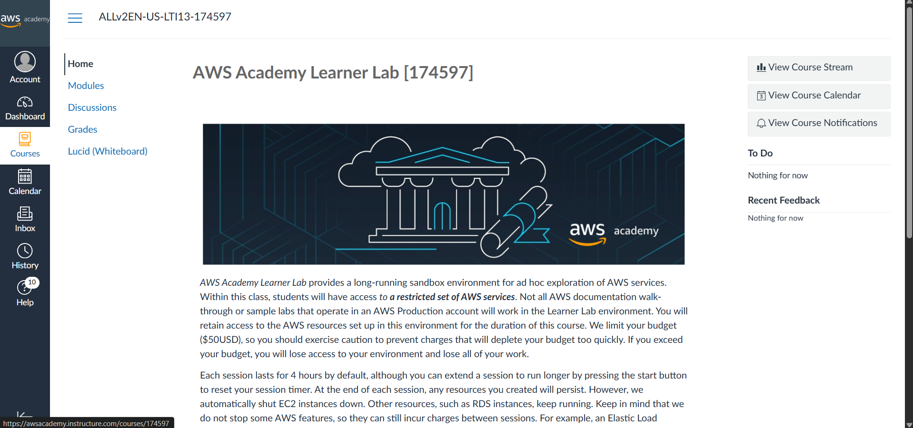
*Página de inicio del curso en AWS Academy.*

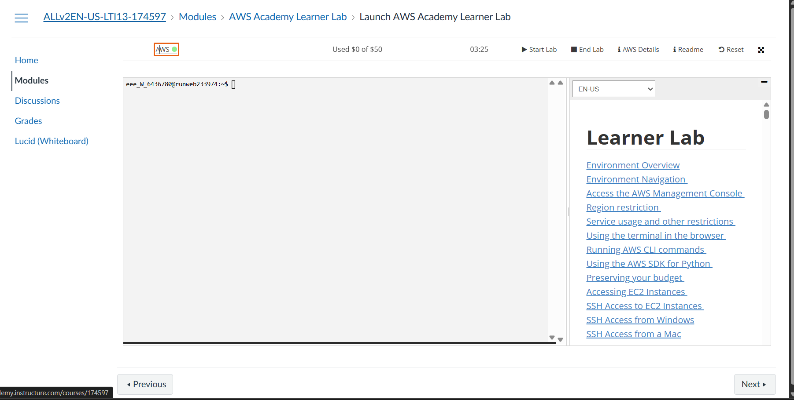
*Learner Lab iniciado (punto verde, timer corriendo).*


*Consola de AWS abierta, región us-east-1 confirmada.*

### Security Groups


*Reglas de entrada/salida configuradas para `alb-ha-sg`.*


*Error de AWS al intentar nombrar el grupo `sg-alb-ha` (desviación documentada
en la sección 3.2).*

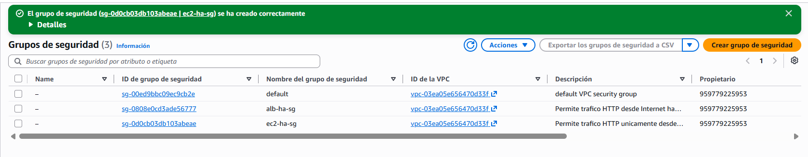
*Los tres Security Groups existentes: `default`, `alb-ha-sg`, `ec2-ha-sg`.*

### Instancias EC2

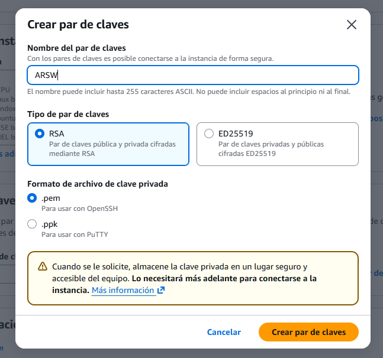
*Creación del par de claves `ARSW`.*

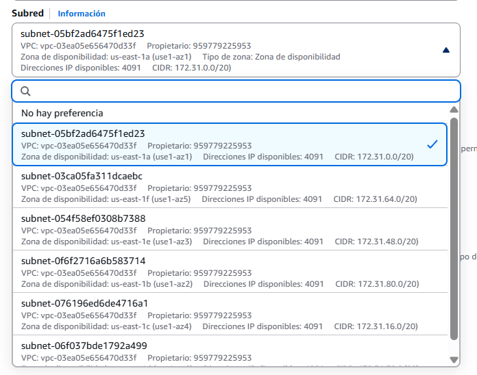
*Selección de subred/AZ para `web-ha-a`.*


*Configuración de red para `web-ha-b`, corrigiendo el Security Group.*


*Perfil de instancia de IAM dejado en "Ninguno".*

**Evidencia requerida — dos instancias EC2 en ejecución (punto 2 del Reto final):**


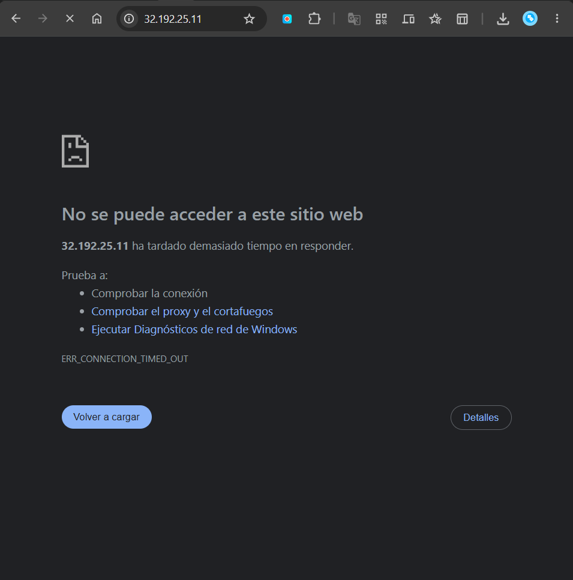
*Prueba directa por IP bloqueada antes de crear el ALB (inconsistencia
documentada en la sección 3.3).*


*Respuesta directa de la instancia A.*

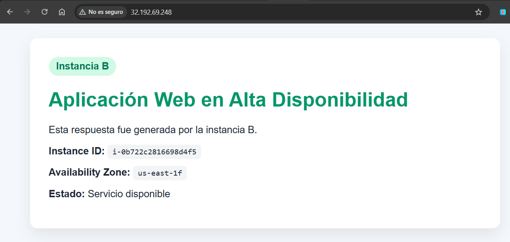
*Respuesta directa de la instancia B.*


*Health check `/health` de la instancia A → `OK`.*

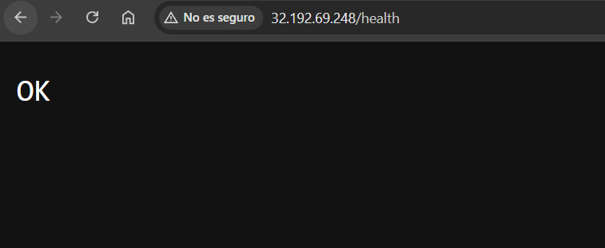
*Health check `/health` de la instancia B → `OK`.*

### Target Group y Application Load Balancer

**Evidencia requerida — Target Group creado (punto 3 del Reto final):**

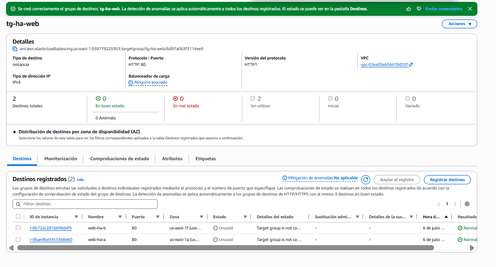

**Evidencia requerida — Application Load Balancer creado (punto 4 del Reto final):**


**Evidencia requerida — Target Group con ambos destinos Healthy (punto 3 del Reto final):**


### Balanceo de carga

**Evidencia requerida — respuesta desde instancia B vía ALB (punto 6 del Reto final):**


**Evidencia requerida — respuesta desde instancia A vía ALB (punto 5 del Reto final):**

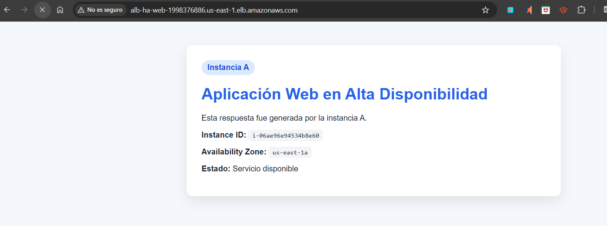

### Simulación de falla y recuperación

**Evidencia requerida — falla simulada (punto 7 del Reto final):**

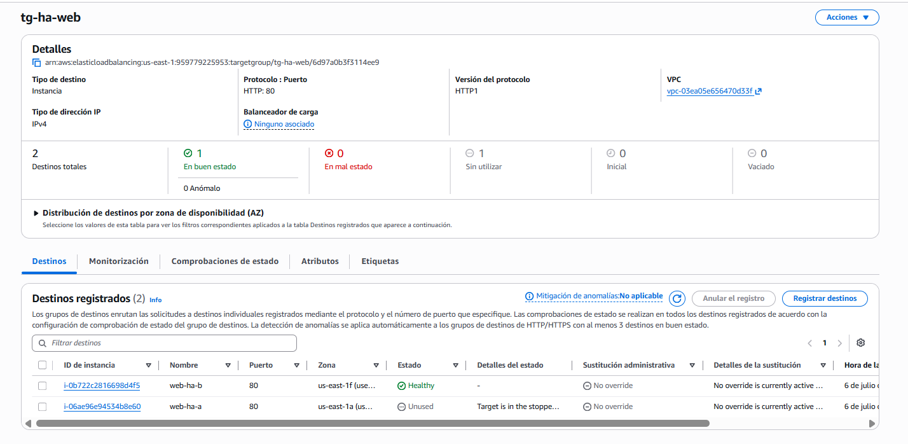

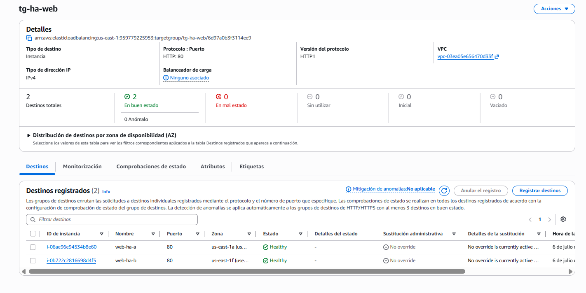
*Recuperación: ambas instancias de vuelta en Healthy tras reiniciar `web-ha-a`.*

## 9. Limpieza de recursos

Al finalizar, eliminar en este orden: Application Load Balancer → Target Group →
Instancias EC2 → Security Groups. *Estado: pendiente.*
